# T02: Còpies de Seguretat a Linux amb Duplicity

Ara començarem a fer les còpies de seguretat a Linux amb un Ubuntu Server i amb el disc dur addicional de 10 GB.

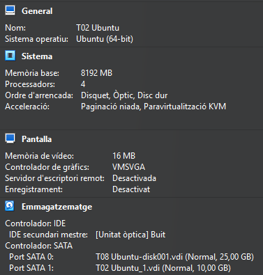

En entrar a la màquina Ubuntu veiem que ens apareix el segon disc que hem afegit.

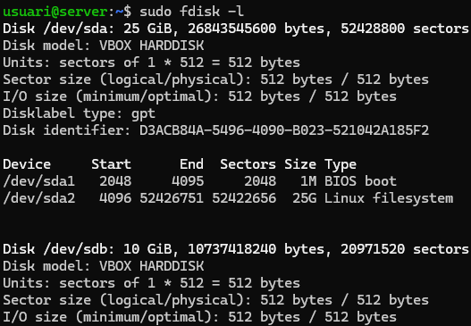

---

## 1. Creació de la partició

Ara haurem de crear una nova partició en el disc.

```bash
sudo fdisk /dev/sdb
```

### Passos:
- n  (nova partició)  
- p  (primària)  
- ENTER (valors per defecte)  
- w  (guardar)


I ara podem veure que s’ha creat correctament.

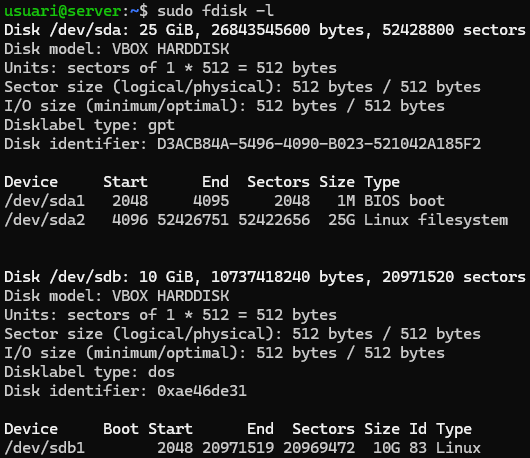

---

## 2. Format i muntatge

I ara li donarem format XFS amb la següent comanda:

```bash
sudo mkfs.xfs /dev/sdb1
```

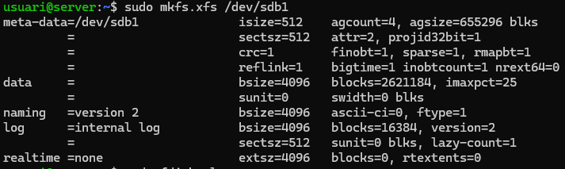

Un cop amb el disc dur formatat, creem el punt de muntatge manualment a `/media/backup`.

Creem la carpeta.

```bash
sudo mkdir -p /media/backup
```

I després fem el muntatge manualment.

```bash
sudo mount /dev/sdb1 /media/backup
```

---

## 3. Instal·lació de Duplicity

```bash
sudo apt install duplicity
```

Comprovem que s’ha instal·lat correctament:

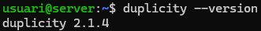

---

## 4. Creació d’usuaris

Crearem un parell d’usuaris amb carpeta personal:

```bash
sudo useradd -m -s /bin/bash usuari2
sudo useradd -m -s /bin/bash usuari3
```

Comprovem que s’han creat correctament:

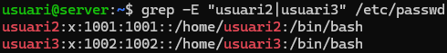

Creem contrasenya per a iniciar sessió:

```bash
sudo passwd usuari2
sudo passwd usuari3
```

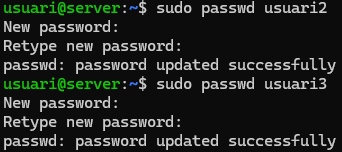

---

## 5. Creació d’arxius de prova

Crearem 4 arxius de 10 MB a la carpeta home de l'usuari principal.

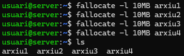

---

## 6. Còpia completa

Fem la còpia de seguretat de la carpeta /home:

```bash
sudo duplicity full /home/ file:///media/backup/
```

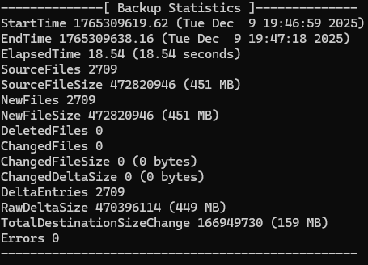

I podem veure que s’han creat els arxius de la còpia de seguretat a la ubicació que li hem indicat, en aquest cas el disc secundari.

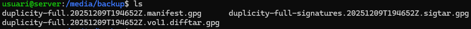

---

## 7. Restauració de dades

Esborrem els fitxers de prova:

```bash
rm arxiu*
```

Fem la restauració:

```bash
sudo duplicity restore file:///media/backup/ /home/usuari
```

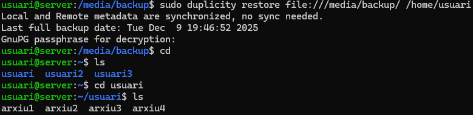

I podem veure que s'han restaurat correctament.

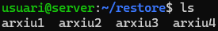

---

## 8. Còpia incremental

Afegim un nou arxiu de 4 MB:

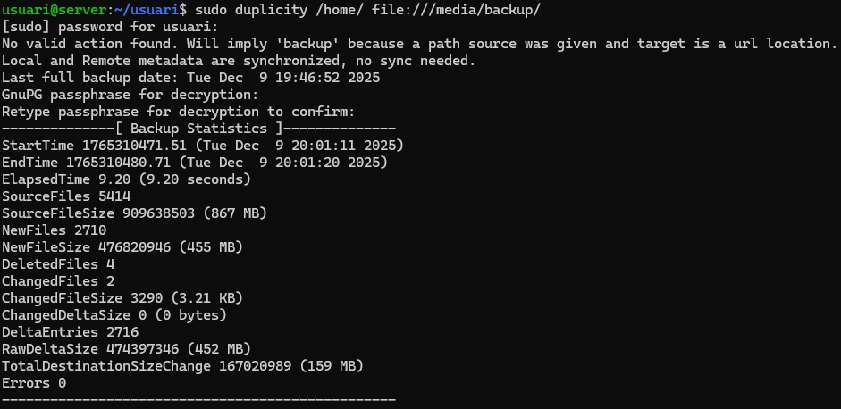

Fem una nova còpia: detecta només 1 fitxer nou i fa una còpia incremental.


---

## 9. Script de còpia automàtica

Desmuntem la unitat del backup:

```bash
sudo umount /media/backup
```

Creem l’script `fullbackup.sh`:

```bash
!/bin/bash

export PASSPHRASE="usuariusuari1234"

mount /dev/sdb1 /media/backup

duplicity full /home file:///media/backup/homebackup

umount /media/backup
```

Donem permisos d’execució:

```bash
sudo chmod +x fullbackup.sh
```

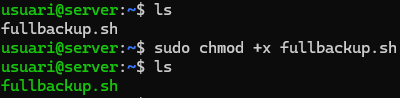

---

## 10. Programació amb CRON

Programem el cron com a root perquè s’executi diumenges a les 23:00.

```bash
sudo crontab -e
```


## 11. Script de còpia automàtica incremental

Creem l’script `incrementalbackup.sh` per a còpies incrementals:

```bash
!/bin/bash

export PASSPHRASE="usuariusuari1234"

mount /dev/sdb1 /media/backup

duplicity incremental /home file:///media/backup/homebackup

umount /media/backup
```

Donem permisos d’execució:

```bash
sudo chmod +x incrementalbackup.sh
```


## 12. Programació amb CRON

Programem cron perquè s’executi de dilluns a dissabte a les 23:00:

```bash
sudo crontab -e
```

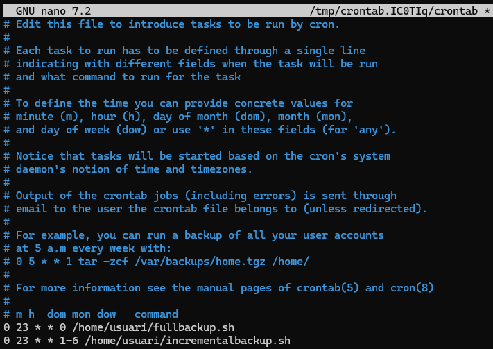
