# T05: Accés Remot. Connexió via SSH

---

## 1. Preparació de les màquines

Creem les dues màquines virtuals, una amb Windows i l’altra amb Linux (Ubuntu). Una vegada dins de la màquina virtual d'Ubuntu, executarem les següents comandes per instal·lar SSH:

```bash
sudo apt install ssh -y
```

I després comprovem que s’ha instal·lat correctament.


---

Apaguem la màquina i afegim una segona interfície en **Host Only** perquè les màquines es vegin entre elles.


Arranquem la màquina i editem el netplan per assignar-li una IP a la interfície:

```bash
sudo nano /etc/netplan/50-cloud-init.yaml
```


Una vegada amb l’arxiu modificat, apliquem els canvis:

```bash
sudo netplan apply
```

I comprovem que s’ha assignat correctament.


---

Encenem la màquina Windows i afegim la segona interfície en **Host Only** perquè es puguin veure les dues màquines.  

A dins de Windows, ens dirigim a **“Ver conexiones de red”** per editar la configuració de l'adaptador i comprovem que s’ha assignat correctament.


I comprovem que **s’ha assignat correctament** i que es **veuen entre elles**.


---

## 2. Connexió SSH inicial

Un cop completades les passes anteriors, ja ens podem connectar a la màquina Ubuntu des de la terminal de Windows amb:

```bash
ssh usuari@192.168.56.200
```

Ens apareix un missatge de seguretat ja que és la primera vegada que ens connectem, i ens demana confirmar l'autenticitat de la clau pública.  


L’acceptem i ens connectem correctament, apareixent el terminal de la màquina Ubuntu.


---

## 3. Configuració del servidor SSH a Ubuntu

Un cop dins de la màquina a través de SSH, podem editar l’arxiu de configuració:

```bash
sudo nano /etc/ssh/sshd_config
```


Podem:
- Permetre o no connexions de root.
- Canviar el port de connexió (per defecte 22).
- Fer una llista d’usuaris autoritzats per connexió remota.

Per deshabilitar l'accés SSH per a l'usuari root, modifiquem l’arxiu `/etc/ssh/sshd_config` i canviem les següents línies.


Canviar la contrasenya del root:

```bash
sudo passwd root
```


Si intentem fer SSH com a root, no ens deixarà.  


Però podem iniciar sessió de manera local sense problemes.


---

## 4. Permetre connexió només a usuaris autoritzats

Creem un nou usuari `usuari2`:

```bash
sudo useradd -m -s /bin/bash usuari2
```


Assignem una contrasenya:

```bash
sudo passwd usuari2
```

Afegim l'usuari autoritzat a l’arxiu SSH:

```bash
sudo nano /etc/ssh/sshd_config
```

Afegim la línia:

```text
AllowUsers usuari
```


Reiniciem el servei per aplicar els canvis:

```bash
sudo systemctl restart ssh
```

Ara, si intentem iniciar sessió amb `usuari2` no podrem, mentre que amb l’usuari `usuari` sí que funciona.


---

## 5. Connexió SSH sense contrasenya amb clau pública

Al client Windows generem la clau:

```bash
ssh-keygen -t ed25519
```

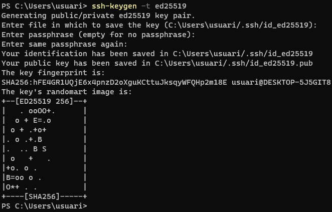

La clau es guarda per defecte a:

```
C:\Users\usuari\.ssh
```

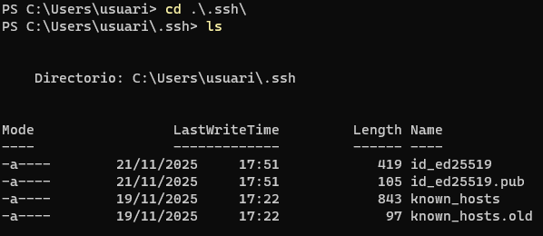

---

Copiem la clau pública al servidor Ubuntu:

```bash
scp id_ed25519.pub usuari@192.168.56.200:/home/usuari
```

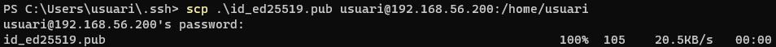

Pel que si ens dirigim al servidor, podem veure que a la carpeta **/home/usuari** s’ha passat l’arxiu correctament.

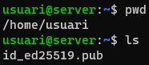

Ens dirigim a la carpeta **.ssh** i podem veure que hi ha un arxiu anomenat **authorized\_keys**.


Al servidor, afegim la clau a l'arxiu `authorized_keys`:

```bash
cat /home/usuari/id_ed25519.pub >> .ssh/authorized_keys
```

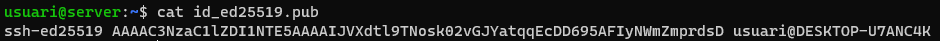

Ara podem fer SSH sense contrasenya:

```bash
ssh usuari@192.168.56.200
```

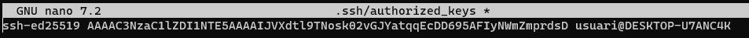

---

## 6. Millorar la seguretat del servidor

Deshabilitar autenticació per contrasenya:

```bash
sudo nano /etc/ssh/sshd_config
```

Modificar:

```
PasswordAuthentication no
```

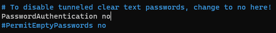

---

## 7. Configurar Windows com a servidor SSH

### 7.1 Mètode gràfic

- Obrir **Características opcionales**


- Fer clic a **Ver características**
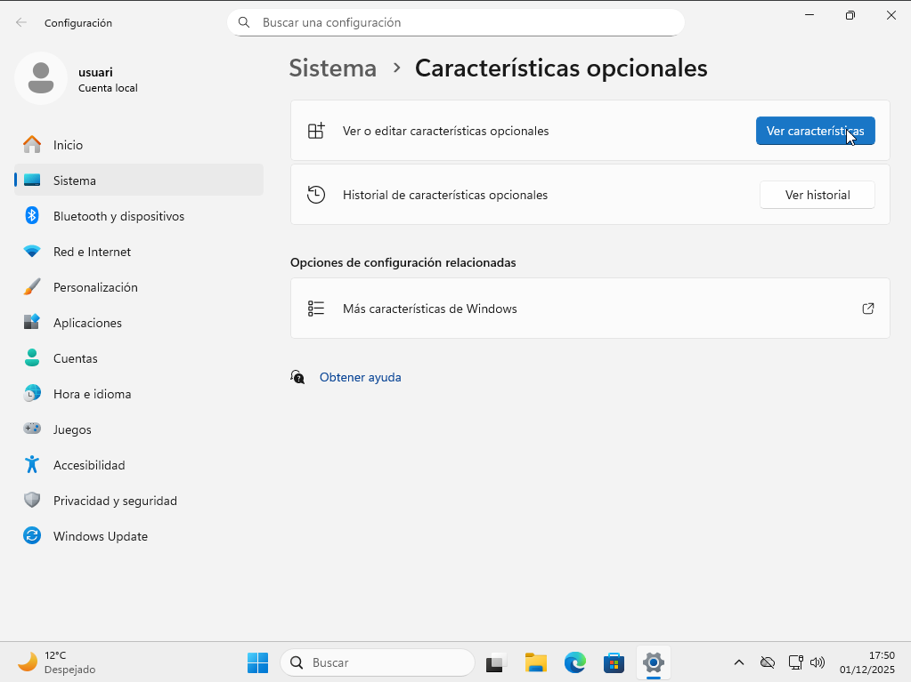

- Seleccionar **Servidor OpenSSH** i afegir-lo
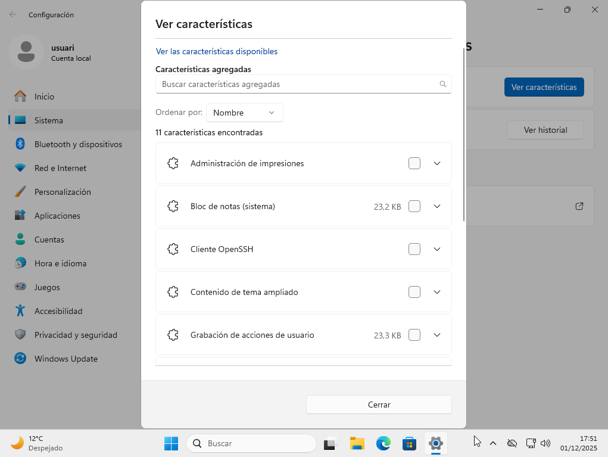

### 7.2 Mètode PowerShell

Comprovar disponibilitat:

```powershell
Get-WindowsCapability -Online | Where-Object Name -like 'OpenSSH*'
```


Instal·lar:

```powershell
Add-WindowsCapability -Online -Name OpenSSH.Server~~~~0.0.1.0
```

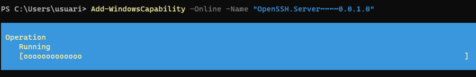

Habilitar servei i inici automàtic:

```powershell
Start-Service sshd
Set-Service -Name sshd -StartupType 'Automatic'
```

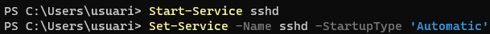

Una vegada amb això fet, podrem connectar-nos des de la màquina Linux al Windows a través de ssh, però per defecte Windows bloqueja les connexions entrants així que deshabilitem el firewall de Microsoft Defender per a permetre la connexió.

Una vegada amb el firewall desactivat, ja ens podem connectar satisfactòriament des del Linux.

```bash
ssh usuari@192.168.56.201
```


I podem veure com estem a dins del sistema


---

## 8. Creació d’un túnel SSH

Afegim una nova interfície NAT als dos equips.  

Al Linux, modifiquem l’arxiu `/etc/netplan/50-cloud-init.yaml` de manera que afegim la nova interfície perquè se li assigni una IP a través de DHCP:

```bash
sudo nano /etc/netplan/50-cloud-init.yaml
```

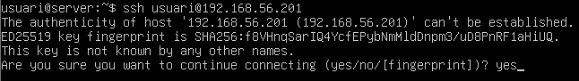

```bash
sudo netplan apply
```

Comprovem IP assignada:

```bash
ip a
```

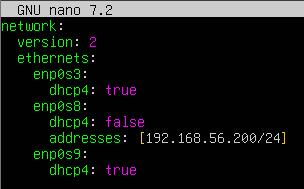

I podem veure que se li ha assignat l’IP **10.0.2.6** i serà la IP que haurà d’utilitzar el client Windows per a fer la connexió.

Des del client Windows, creem un túnel dinàmic al port 9876:

```bash
ssh -D 9876 usuari@10.0.2.6
```

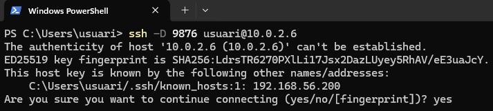

---

## 9. Configuració del client per redirigir tràfic

1. Obrir **Propiedades de Internet → Configuración de LAN**

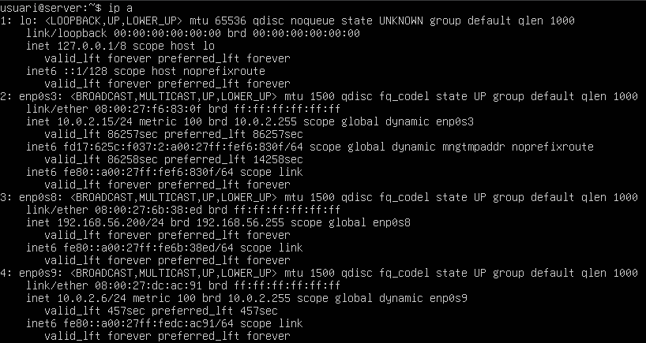

2. Clic a **Opciones avanzadas**
   


3. Afegir port del túnel (9876)

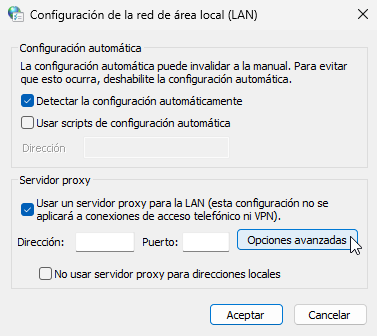

---

## 10. Comprovació del tràfic amb Wireshark

Per a comprovar que el tràfic passa pel túnel haurem d'instal·lar l'eina Wireshark.

- **Sense túnel:** tràfic normal, DNS directe, ports estàndard  

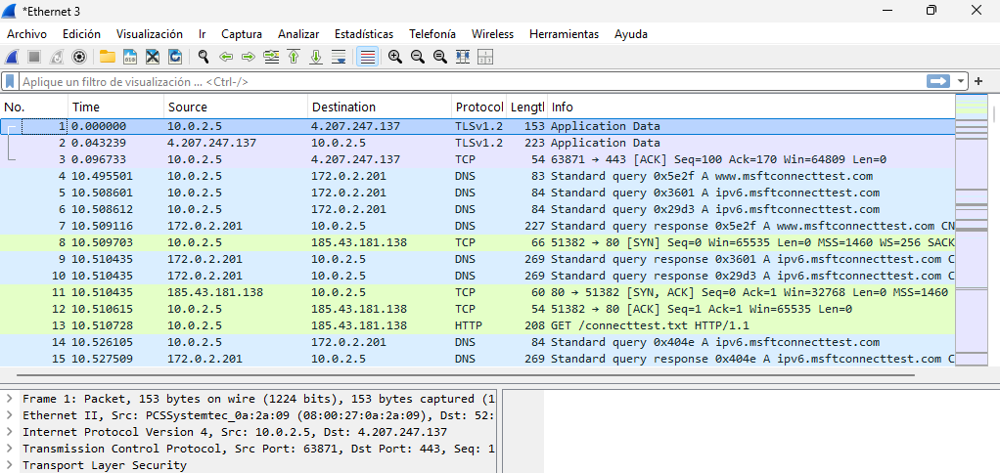

- **Amb túnel:** tot el tràfic passa xifrat per SSH


