# T05: Accés Remot. Connexió via SSH

Creem les dues màquines virtuals, una amb Windows i l’altra amb Linux (Ubuntu). Una vegada dins de la màquina virtual d'Ubuntu, executarem les següents comandes per instal·lar SSH:

```bash
sudo apt install ssh -y
```

I després comprovem que s’ha instal·lat correctament.

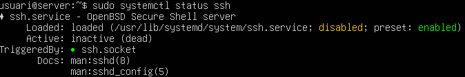

---

Apaguem la màquina i afegim una segona interfície en **Host Only** perquè les màquines es vegin entre elles.

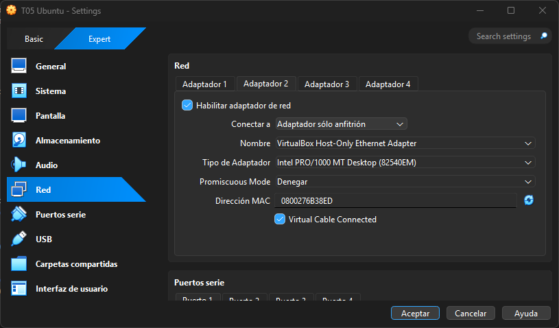

Arranquem la màquina i editem el netplan per assignar-li una IP a la interfície:

```bash
sudo nano /etc/netplan/50-cloud-init.yaml
```

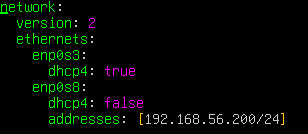

Una vegada amb l’arxiu modificat, apliquem els canvis:

```bash
sudo netplan apply
```

I comprovem que s’ha assignat correctament.

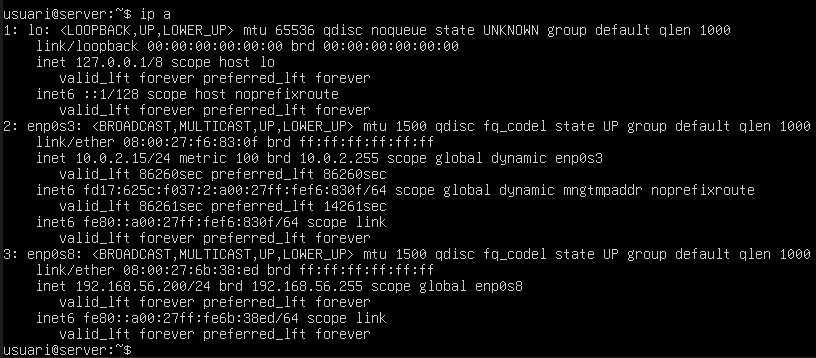

---

Encenem la màquina Windows i afegim la segona interfície en **Host Only** perquè es puguin veure les dues màquines.  

A dins de Windows, ens dirigim a “Ver conexiones de red” per editar la configuració de l'adaptador i comprovem que s’ha assignat correctament.


I comprovem que **s’ha assignat correctament** i que es **veuen entre elles**.

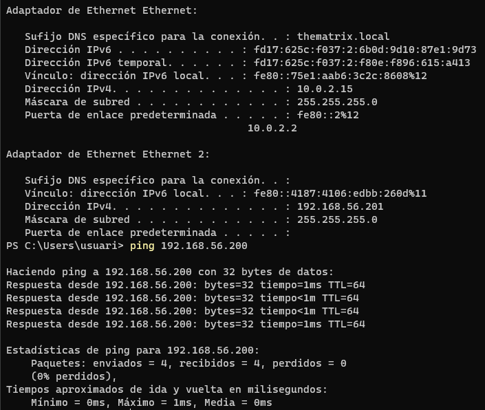

---

Un cop completades les passes anteriors, ja ens podem connectar a la màquina Ubuntu des de la terminal de Windows amb:

```bash
ssh usuari@192.168.56.200
```

Ens apareix un missatge de seguretat ja que és la primera vegada que ens connectem, i ens demana confirmar l'autenticitat de la clau pública.  

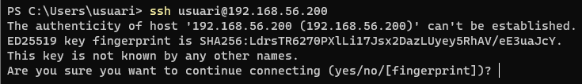

L’acceptem i ens connectem correctament, apareixent el terminal de la màquina Ubuntu.

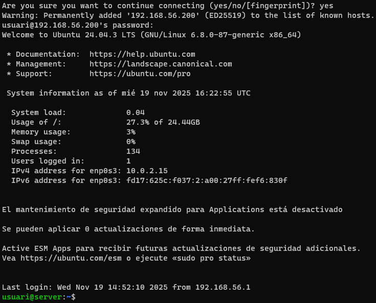

---

Un cop dins de la màquina a través de SSH, podem editar l’arxiu de configuració:

```bash
sudo nano /etc/ssh/sshd_config
```
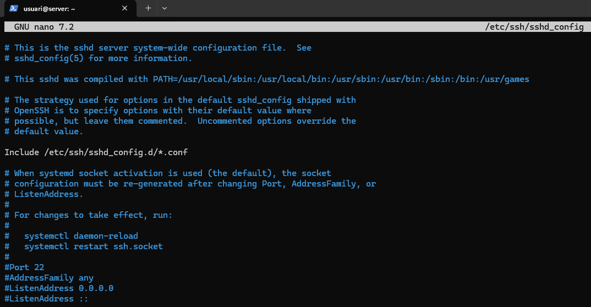

Per exemple, podem:
- Permetre o no connexions de root.
- Canviar el port de connexió (per defecte el 22).
- Fer una llista d’usuaris autoritzats per connexió remota.

Per deshabilitar l'accés SSH per a l'usuari root, modifiquem l’arxiu `/etc/ssh/sshd_config` i canviem les següents línies.

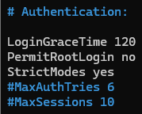

Comprovem que només es pot iniciar sessió en root localment i no per SSH. Per a fer-ho haurem de canviar la contrasenya del root amb la següent comanda:

```bash
sudo passwd root
```

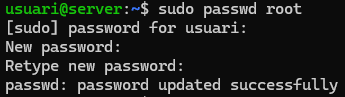

Si intentem fer SSH com a root, no ens deixarà.  

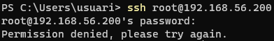

Però podem iniciar sessió de manera local sense problemes.

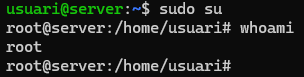

---

Per permetre connexió remota només a usuaris autoritzats:

Creem un nou usuari `usuari2`:

```bash
sudo useradd -m -s /bin/bash usuari2
```

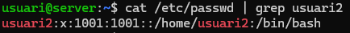

Assignem una contrasenya:

```bash
sudo passwd usuari2
```

Afegim l'usuari autoritzat a l’arxiu SSH:

```bash
sudo nano /etc/ssh/sshd_config
```

Afegim la línia:

```text
AllowUsers usuari
```

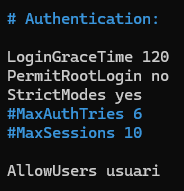

Reiniciem el servei per aplicar els canvis:

```bash
sudo systemctl restart ssh
```

Ara, si intentem iniciar sessió amb `usuari2` no podrem, mentre que amb l’usuari `usuari` sí que funciona.

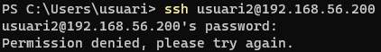

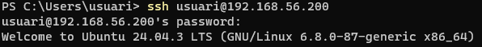
