# T06: Accés Remot — Escriptori Remot (RDP) (tasca individual)

## Prepearació de les màquines virtuals

El primer pas és afegir una nova interfície de xarxa `host-only` a cada una de les màquines virtuals, el que permetrà que la màquina Windows es pugui veure amb la màquina Zorin i viceversa. Per a fer-ho haurem de dirigir-nos a la configuració de la màquina virtual i afegir una nova interfície de xarxa amb el mode `Adaptador sólo anfitrión`.

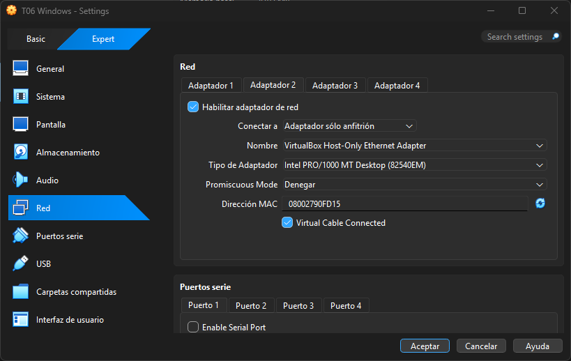

---

## Configuració de la màquina Windows

Una vegada a dins de la màquina Windows, ens dirigim a la opció de `Configuración de Escritorio Remoto`.

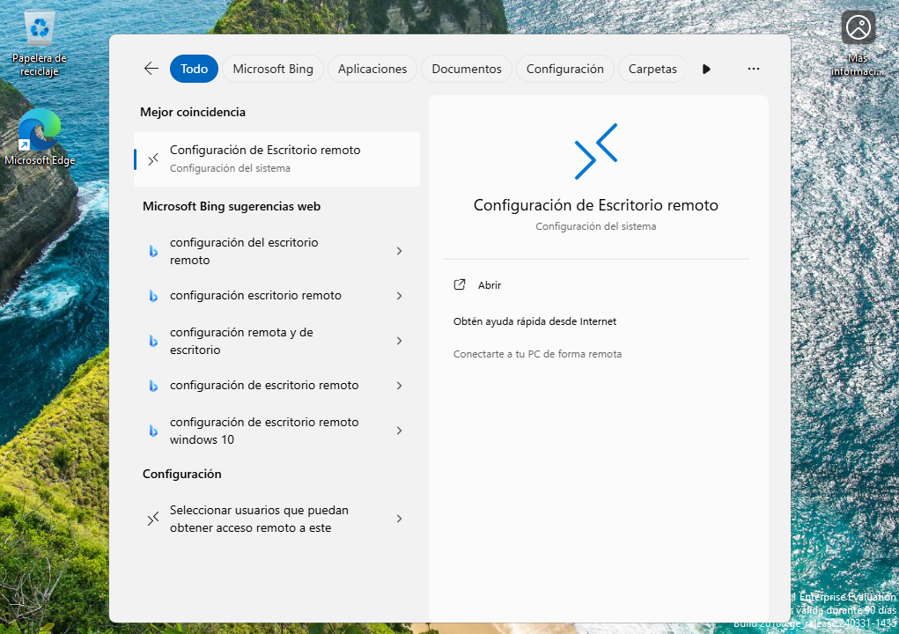

I activem l'opció de `Escritorio Remoto`.

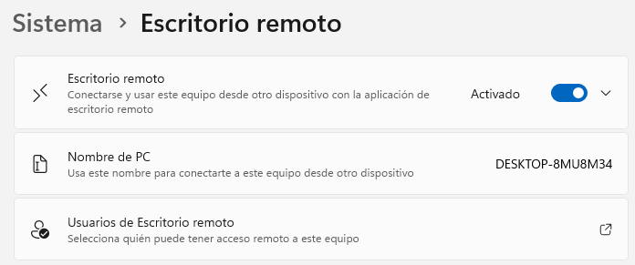

Una vegada amb aquesta opció activada, ja podriem connectar-nos a aquesta màquina des de la màquina Zorin.

---

## Configuració de la màquina Zorin

Ara ens dirigim a la màquina Zorin per a activar per a que es pugui connectar a la màquina Windows remotament. 

Haurem d'anar a `Settings`. I una vegada dins de `Settings`, anem a la opció de `Remote Desktop`.

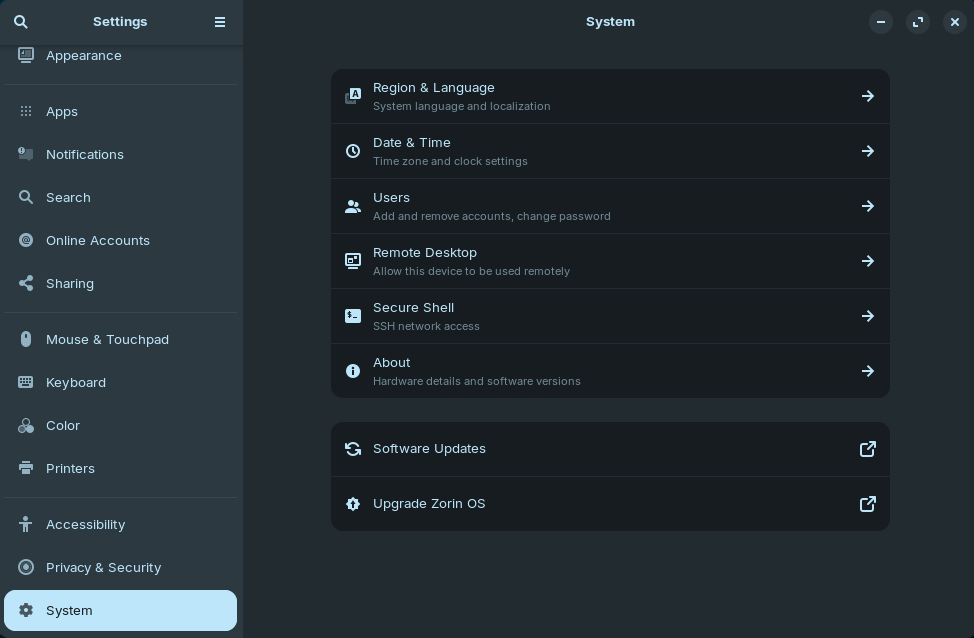

I aquí activem l'opció de `Desktop Sharing` i de `Remote Control` per a que es pugui controlar la màquina remotament. Utilitzem el mateix usuari i contrasenya que utilitzem per a entrar a la màquina Zorin, però podriem canviar-ho si volem.

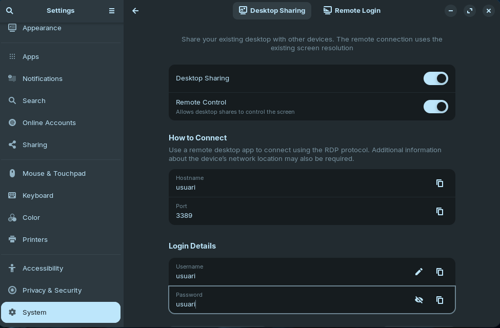

---

## Connexió des de la màquina Windows a la màquina Zorin

Per a connectar-nos des de la màquina Windows a la màquina Zorin, utilitzem l'eina de `Conexión a Escritorio Remoto` que ve per defecte a Windows.

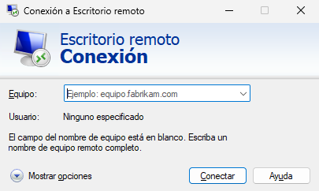

Aquí introduïm la IP de la màquina Zorin (que podem veure amb la comanda `ip a` a la terminal de Zorin) i premem a `Conectar`.

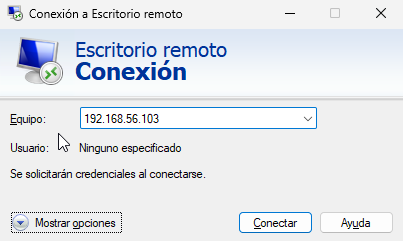

Ens demanarà les credencials d'usuari de la màquina Zorin, les introduïm i premem a `Aceptar`.

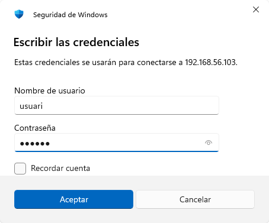

Ens apareixerà una finestra d'advertència de certificat, premem a `Sí` per a continuar.

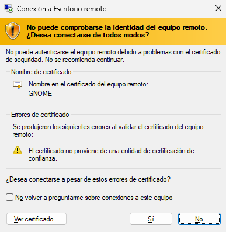

I podem veure que ja estem connectats a la màquina Zorin des de la màquina Windows.

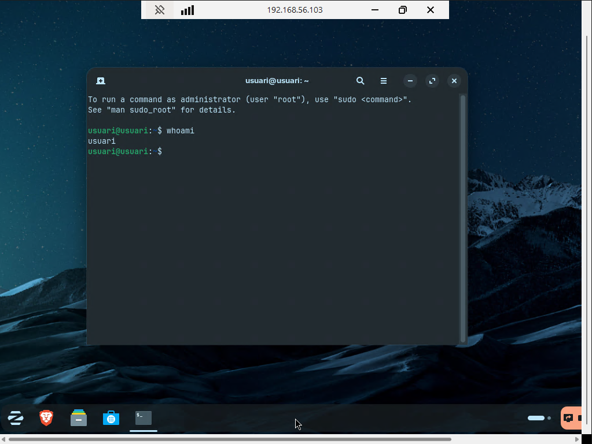

---

## Connexió des de la màquina Zorin a la màquina Windows

Per a connectar-nos des de la màquina Zorin a la màquina Windows, utilitzem l'eina `Remmina`, que ve per defecte a Zorin.

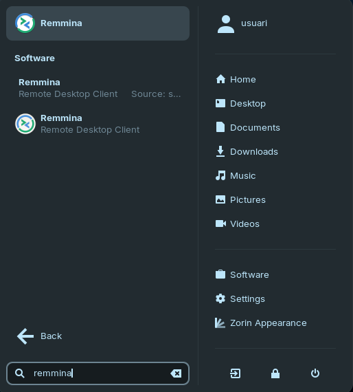

Aquí introduïm la IP de la màquina Windows (que podem veure amb la comanda `ipconfig` a la terminal de Windows) i li donem a `ENTER`.

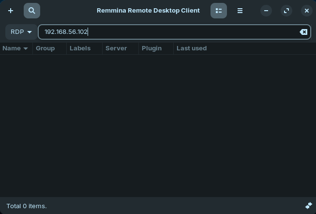

Ens apareix una advertencia de certificat, premem a `Yes` per a continuar.

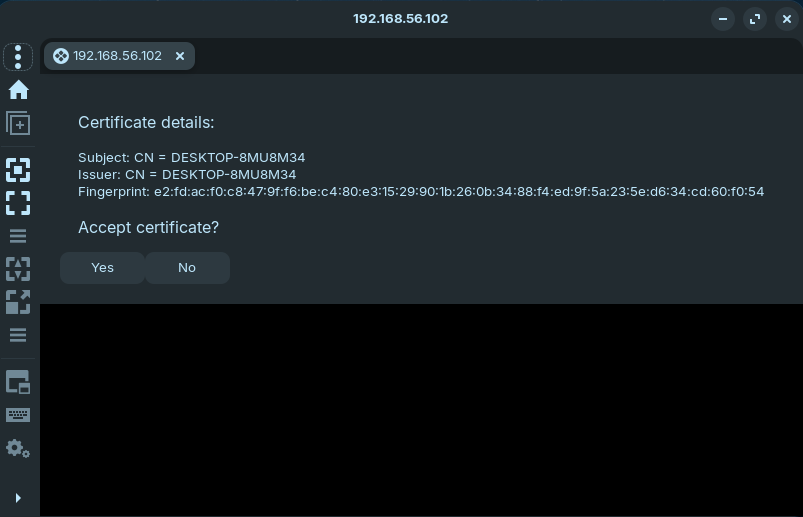

I ens demana les credencials d'usuari de la màquina Windows, les introduïm i premem a `OK`.

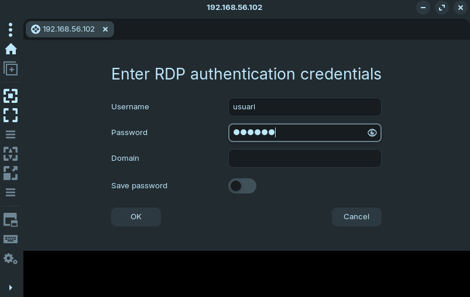

I podem veure que ja estem connectats a la màquina Windows des de la màquina Zorin.

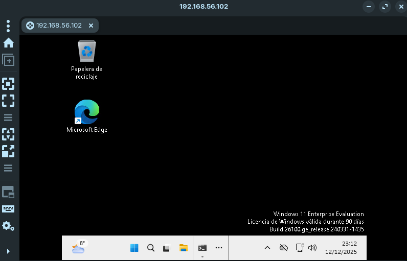

[Tornar a enunciat](README.md)