# T07: Accés remot. Serveis d’assistència remota (tasca en parelles)

## Fase 1: Anàlisi comparativa i selecció de la solució

El primer pas és decidir quina eina utilitzarà EverPia. Pel que hem fet una anàlisi de mercat i un breu informe comparatiu entre les diferents eines d’assistència remota que hi ha al mercat. Un cop feta aquesta anàlisi, hem seleccionat l’eina que millor s’adapta a les necessitats de l’empresa i hem justificat la nostra elecció.

## Taula Comparativa d’Eines d’Assistència Remota

| Criteri | TeamViewer | AnyDesk | Google (Chrome) Remote Desktop | LogMeIn |
|-------|------------|---------|--------------------------------|---------|
| Facilitat d’ús (client) | Requereix descarregar l’aplicació o mòdul QuickSupport. L’usuari ha de facilitar un ID i una contrasenya. | Instal·lació ràpida i lleugera. ID visible i fàcil de comunicar. | Molt senzill si l’usuari té compte Google. Connexió via navegador i PIN. | Accés mitjançant aplicació o enllaç. Pensat per a entorns empresarials. |
| Instal·lació / Portable | Mòdul QuickSupport sense instal·lació completa | Instal·lació lleugera | No requereix instal·lació d’escriptori | Requereix instal·lació de l’agent |
| Windows | ✅ | ✅ | ✅ | ✅ |
| macOS | ✅ | ✅ | ✅ | ✅ |
| Linux | ✅ | ✅ | ✅ | No |
| Dispositius mòbils | ✅ | ✅ | ✅ | ✅ |
| Ús comercial permès en versió gratuïta | No | No | ✅ | No |
| Model de preu | Subscripció per tècnic | Subscripció (més econòmica) | Gratuït | Subscripció (cost elevat) |
| Limitacions de la versió gratuïta | Tall de sessions i detecció d’ús comercial | Funcions avançades limitades | Funcionalitats bàsiques | No disposa de versió gratuïta |

## Justificació de l’Eina Seleccionada

Després d’analitzar les diferents opcions disponibles, es recomana `TeamViewer` com a eina oficial d’assistència remota per a EverPia. Aquesta solució destaca per la seva gran fiabilitat, estabilitat i reconeixement al mercat professional, sent àmpliament utilitzada en entorns empresarials.

---

## Fase 2: Creació de les Guies d'Ús (Documentació)

Un cop seleccionada l'eina a la Fase 1, ara crearem la documentació oficial per al seu ús. Aquesta documentació és crucial i tindrà dues parts: una guia per als tècnics d'assistència i una guia per als usuaris finals.

## Guia per als Tècnics d'Assistència Remota amb TeamViewer

Aquesta guia està destinada als tècnics d'assistència remota d'EverPia per utilitzar `TeamViewer` de manera eficient i segura. 

## Instal·lació de TeamViewer

Per a poder fer assistència remota, hem de tenir instal·lat `TeamViewer` a l'ordinador des del qual es realitzarà l'assistència. Ens dirigim a la pàgina oficial de TeamViewer i descarreguem la versió per a donar suport, es a dir, la versió completa de TeamViewer.

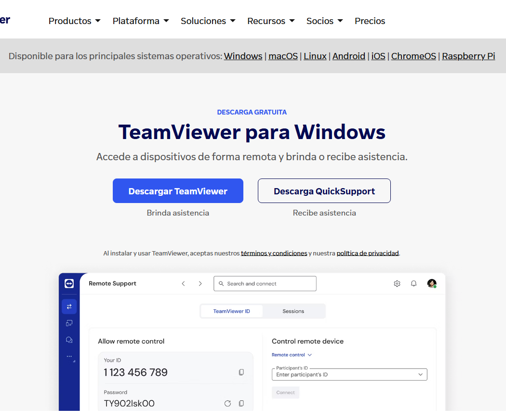

Una vegada descarregat, procedim a la instal·lació seguint els passos de l'assistent d'instal·lació.

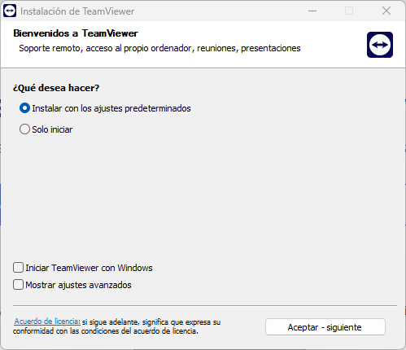

En finalitzar la instal·lació, obrim l'aplicació i ens demana que acceptem la llicència d'ús de TeamViewer.

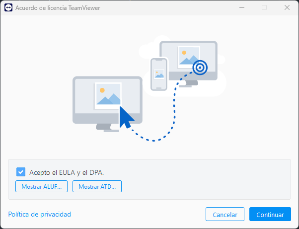

I acceptem les noves funcions que ens ofereix TeamViewer.

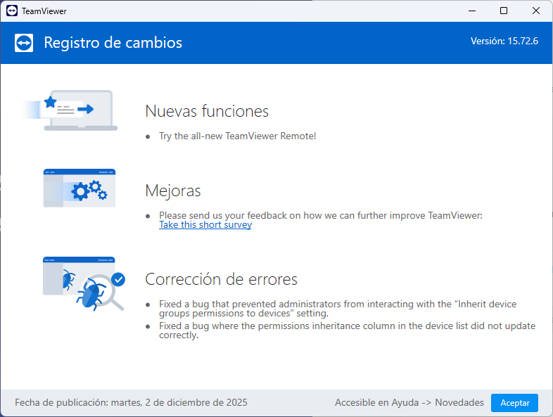

Ens apareix el panell principal de TeamViewer, on podem veure el nostre ID i contrasenya en cas de que necessitéssim rebre assistència, pero l'opció que ens interessa és la de donar assistència remota a un altre usuari, així que iniciem sessió amb les credencials del nostre compte de TeamViewer.

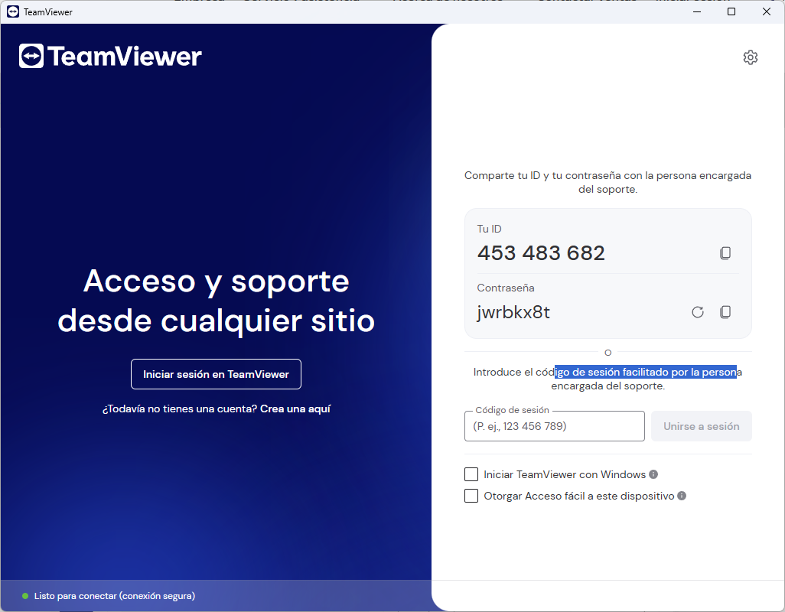

I escollim iniciar sessió amb el nostre compte Google per a més comoditat.

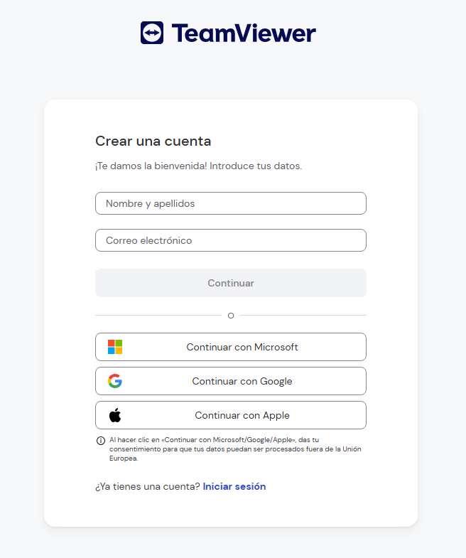

Una vegada dins de l'aplicació, ja podem començar a donar assistència remota als usuaris finals.

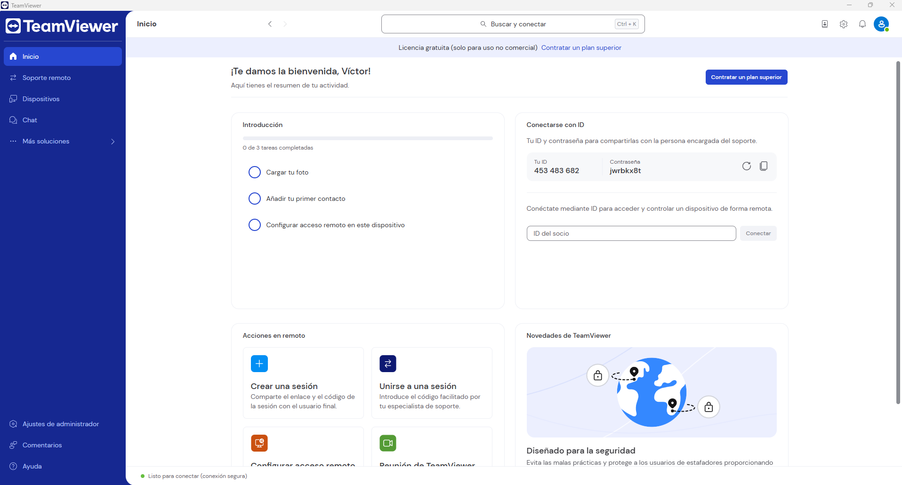

---

## Procés d'Assistència Remota

Per a poder donar assistència remota a un usuari final, primer hem de demanar-li que descarregui i executi el mòdul `TeamViewer QuickSupport` des de la pàgina oficial de TeamViewer. 

---

## 1. Connexió Remota a través del ID i Contrasenya

Una vegada l'usuari final ha executat el mòdul, li demanem que ens faciliti l'ID i la contrasenya que apareixen a la finestra del QuickSupport. I els introduïm a la nostra aplicació de TeamViewer a la secció de `Soporte remoto`.

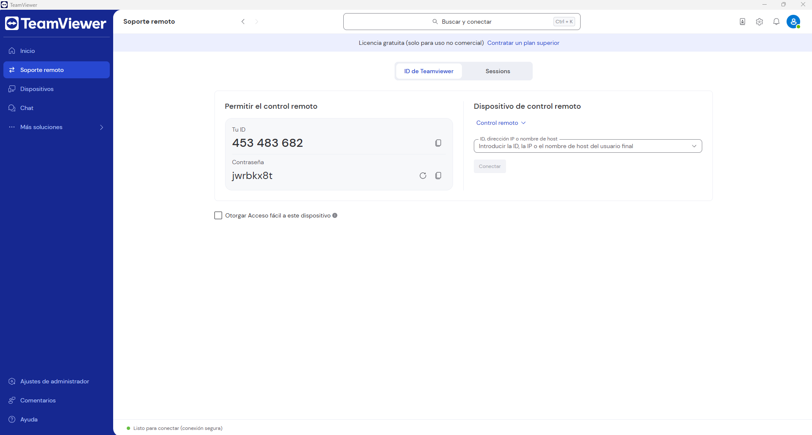

Un cop introduïts, fem clic a `Conectar` i s'establirà la connexió remota amb l'usuari , podent veure i controlar el seu escriptori per ajudar-lo.

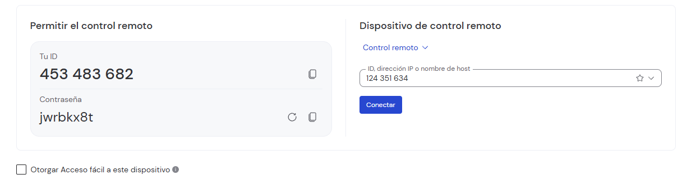

Aqui ens demana la contrasenya que l'usuari ens ha facilitat.

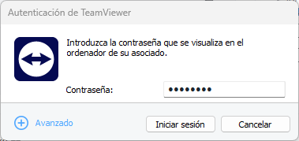

I finalment podem veure que ja estem connectats al seu ordinador.

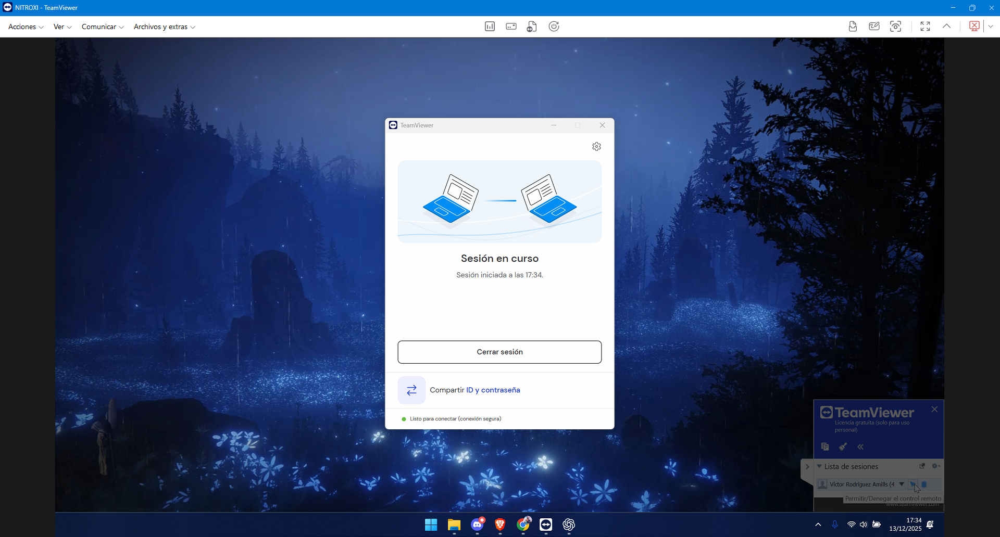

---

## 2. Connexió Remota a través de la sessió

També podem connectar-nos a l'ordinador de l'usuari a través d'una sessió que haurem de crear desde la pestanya de `Sessions` a l'aplicació de TeamViewer donat-li al botó de `Nueva sesión`.

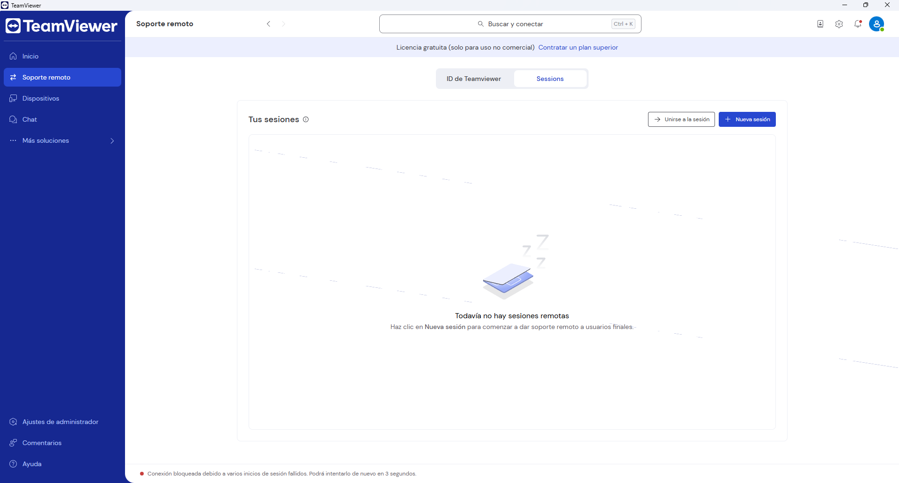

Una vegada amb la sessió creada, l'usuari es pot connectar per un enllaç que li proporcionem o bé introduint el codi de la sessió a la seva aplicació de TeamViewer QuickSupport.

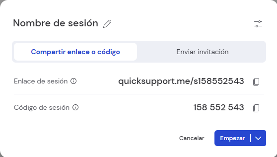

Un cop l'usuari s'ha connectat a la sessió, nosaltres rebem una notificació a la pestanya de `Sessions` i haurem de clicar a `Iniciar sesión` per a iniciar la sessió.

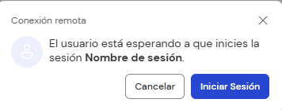

Haurem d'esperar que l'usuari accepti la connexió.

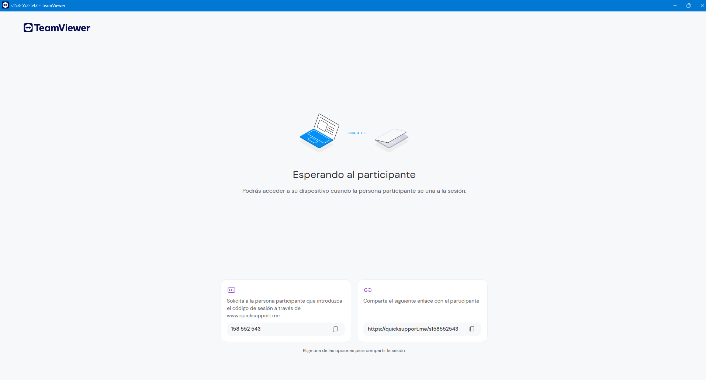

I finalment ja estem connectats a l'ordinador de l'usuari.

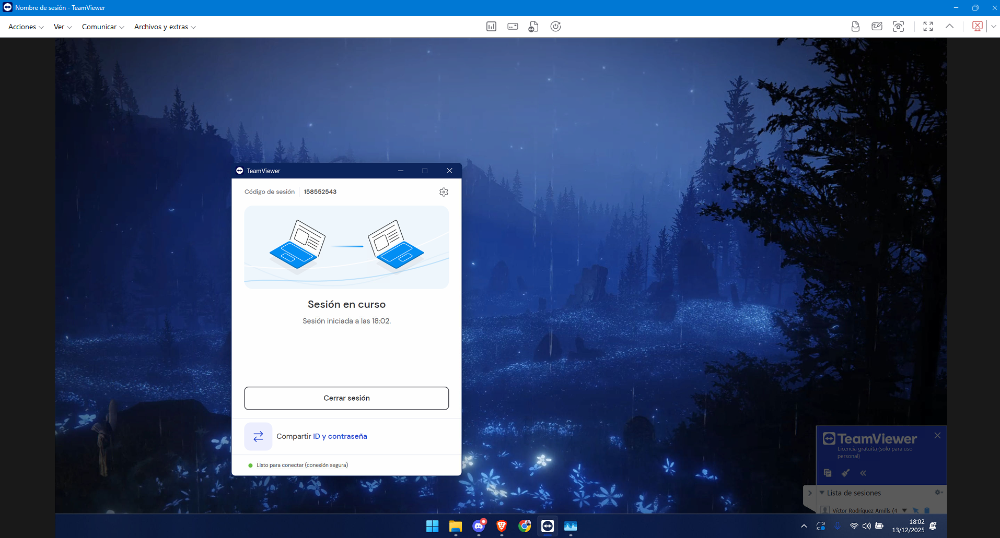

---

## Fuincions Addicionals

Una vegada connectats, podem utilitzar diverses funcions addicionals com transferència de fitxers, xat amb l'usuari, reinici remot, entre altres.

---

## Veure informació sobre el sistema de l'usuari (Panel)

Una de les funcions és poder veure la informació de sobre el sistema de l'usuari, per a això anem a la barra superior i a la primera icona, anomenada `Panel`.  

Aquí podem veure tota la informació del sistema de l'usuari, com el sistema operatiu, processador, memòria RAM, etc. El que és molt útil per diagnosticar problemes del sistema.

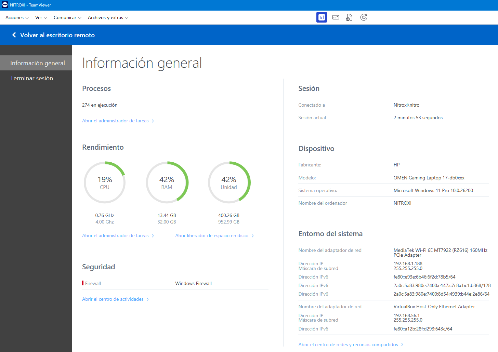

---

## Enviar la seqüència de tecles Ctrl+Alt+Supr

La segona icona és la de enviar la seqüència de tecles `Ctrl+Alt+Supr` a l'ordinador de l'usuari, que ens obrirà el gestor de tasques o la pantalla de bloqueig segons el sistema operatiu.

---

## Transferència de Fitxers

Desrpés tenim la funció de transferència de fitxers, que ens permet enviar o rebre fitxers entre el nostre ordinador i l'ordinador de l'usuari. Per a això anem a la tercera icona, anomenada `Transferencia de archivos`.

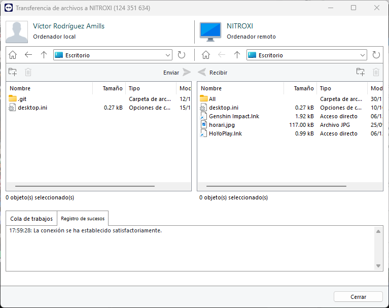

### Reinici Remot de l'Ordindor

Amb la cuarta icona, anomenada `Reiniciar`, podem reiniciar l'ordinador de l'usuari de manera remota.

### Funció de Pissarra

També tenim la funció de `Pizarra` que ens permet dibuixar sobre la pantalla de l'usuari per indicar-li on ha de fer clic o quina opció ha de seleccionar.

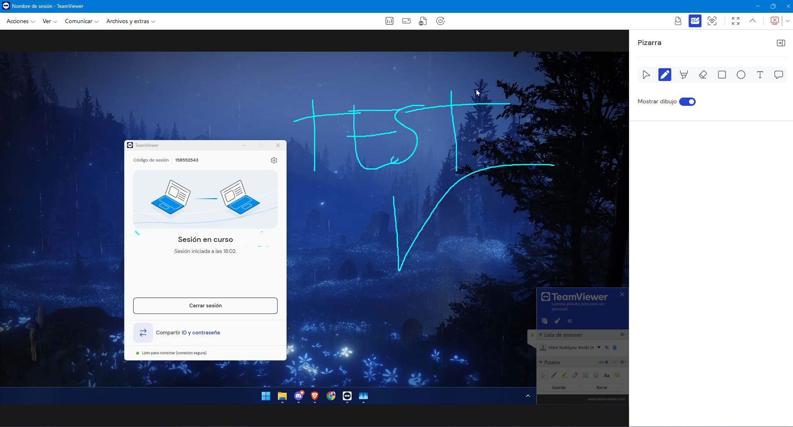

[Tornar a enunciat](README.md)