# T09: Servidor fitxers Linux. NFS

## Fase 1: Preparació de l'entorn (Infraestructura i Xarxa)

Creem dues màquines virtuals, una amb Ubuntu Server 24.04 LTS que actuarà com a servidor NFS i l'altre amb Zorin OS 18, que actuarà com a client.

A les dues màquines les afegim un adaptador de xarxa `host-only` per a que es puguin veure entre elles.

I veiem que es veuen correctament:

Des del servidor al client:


Des del client al servidor:

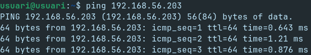

En iniciar-les, actualitzem la llista de paquets i els mateixos paquets amb la següent comanda:

```bash
sudo apt update && sudo apt upgrade -y
```

---

## Fase 2: Preparació Ubuntu Server (Servidor)

### Creació dels grups `devs` i `admins`.

Començarem amb la preparació del servidor, i per això crearem dos grups per al client; devs i admins.

```bash
sudo groupadd devs && sudo groupadd admins
```

I comprovem que s’han creat correctament amb la comanda `grep`.

```bash
cat /etc/group | grep -E "devs|admins"
```

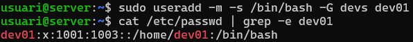

---

### Creació dels usuaris `dev01` i `admin01`.

Creem un usuari `dev01` que és membre del grup `devs`.

```bash
sudo useradd -m -s /bin/bash -G devs dev01
```

I comprovem que s’han creat correctament amb la comanda `grep`.

```bash
cat /etc/passwd | grep -e dev01
```

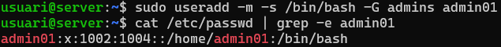

I fem el mateix amb `admin01` i el grup `admins`.

```bash
sudo useradd -m -s /bin/bash -G admins admin01
```

```bash
cat /etc/passwd | grep -e admin01
```

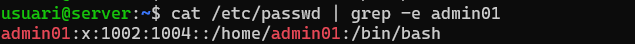

---

### Creació dels directoris `dev_projects` i `admin_tools`.

Ara creem un directori per als projectes de desenvolupament.

```bash
sudo mkdir -pv /srv/nfs/dev_projects
```

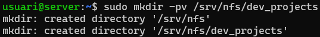

I un altre per a les eines d’administració.

```bash
sudo mkdir -pv /srv/nfs/admin_tools
```

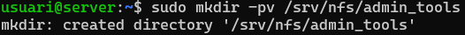

---

### Modificació dels permisos.

I modifiquem els permisos de manera que els developers tinguin control total sobre els seus projectes i els administradors sobre les seves eines.

```bash
sudo chown :devs dev_projects/
sudo chown :admins admin_tools/
```

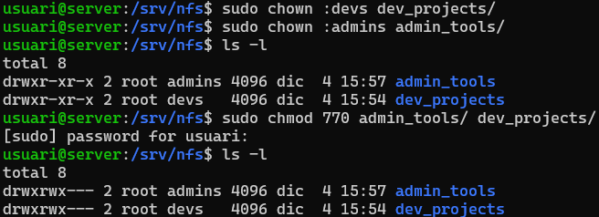

---

## Fase 2: Preparació Zorin OS 18 (Client)

Ara repetirem la mateixa configuració que hem creat en el servidor amb el client.

Per a fer-ho haurem de dirigir-nos a la botiga de **Software** i buscarem la aplicació `Users and Groups` i l'instal·larem.

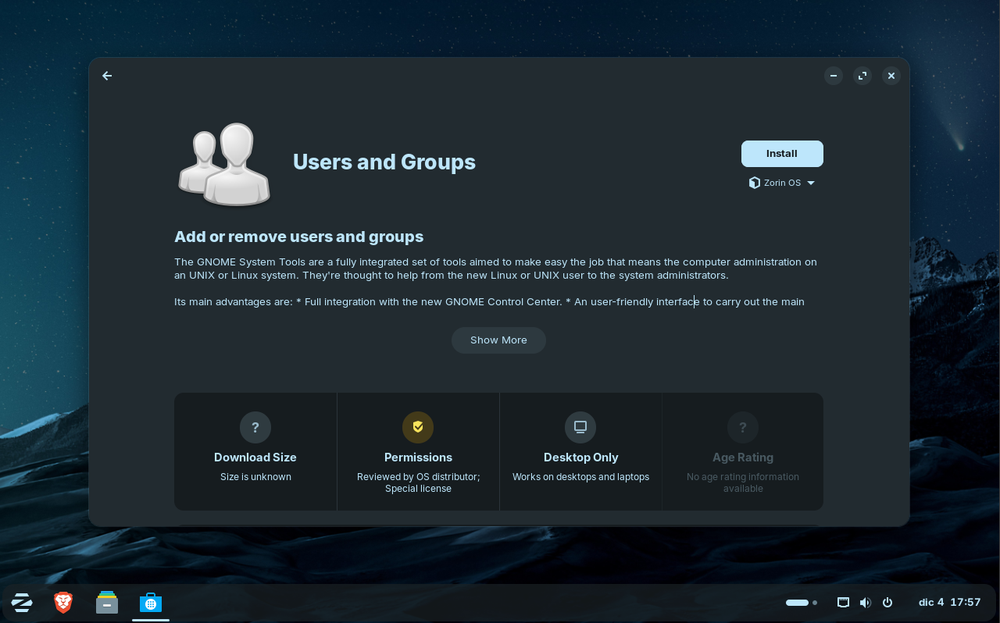

---

### Creació dels grups `devs` i `admins`.

Pel que crearem els mateixos usuaris i grups que en el servidor, intentant mantenir els mateixos `UID` i `GID`.

Per a fer-ho haurem de donar-li a **Manage Groups** per a crears els grups `devs` i `admins`.

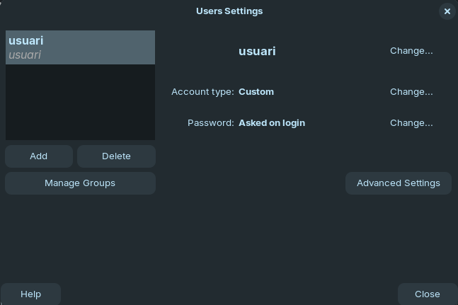

I una vegada a dins li donem a **Add** per a crear-ho.


I fiquem el nom del primer grup `devs` amb GID `1001`.

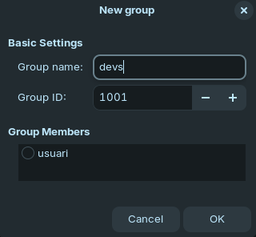

I segon grup `admins` amb GID `1002`.

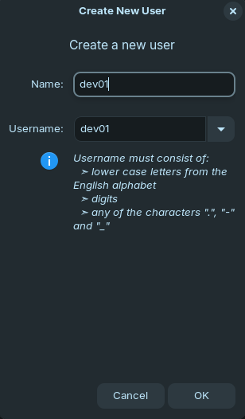

---

### Creació dels usuaris `dev01` i `admin01`.

Una vegada amb els grups creats el próxim pas es crear els usuaris `dev01` i `admin01`.

Pel que tornarem al menú principal i farem clic a **Add**


En donar-li crearem el primer usuari `dev01`.

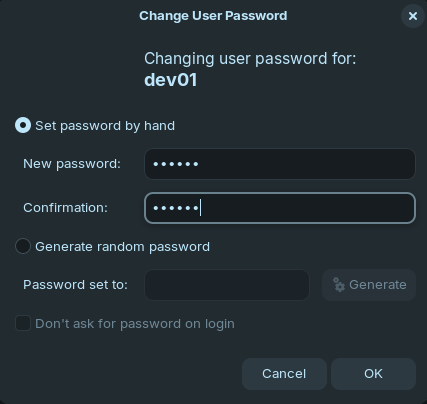

I li assignarem una contrassenya.

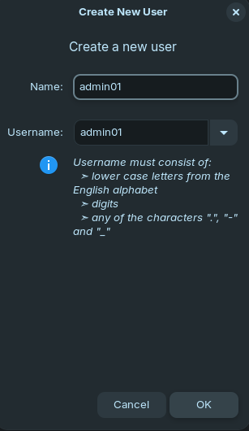

Després crearem el segon usuari `admin01`.

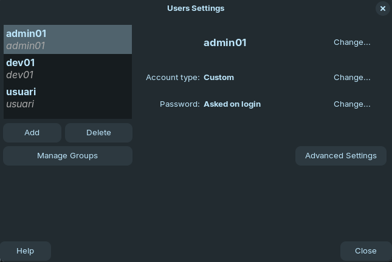

I també li assignarem una contrassenya.


I finalment podem veure que s'han creat correctament


Ara haurem d'afegir-los als grups corresponents. En aquest cas el grup `devs` a l'usuari `dev01`.

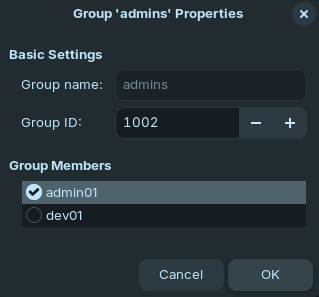

I després el grup `admins` a l'usuari `admin01`.

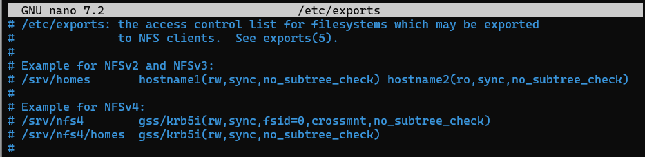

---

## Fase 2: Instal·lació i configuració del servei NFS (Servidor)

Ara instal·larem el servidor NFS i totes les seves dependències:

```bash
sudo apt install nfs-kernel-server -y
```

I veiem que s'ha instal·lat correctament.

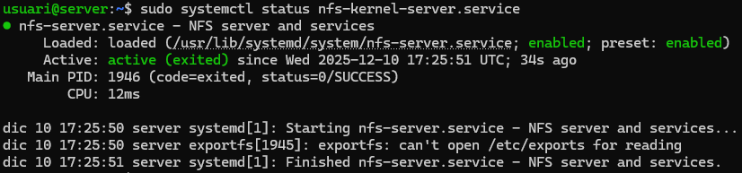

Ara caldrà configurar l'exportació dels directoris amb les opcions corresponents.

Per a fer-ho haurem de editar l'arxiu `/etc/exports`.

```bash
sudo nano /etc/exports
```


I afegim la seguent línia:

```bash
/srv/nfs 192.168.56.105(rw,sync)
```


Un cop configurat, ja reiniciem el servei al servidor.

```bash
sudo systemctl restart nfs-kernel-server
```

I comprovem què estem compartint via NFS.

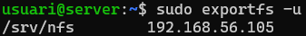

---

## Fase 2: Instal·lació i configuració del servei NFS (Client)

Ara cal instal·lar el client NFS al Zorin.

```bash
sudo apt install nfs-common -y
```

I comprovarem que té accés al recurs del servidor i podem veure que el veu correctament.

```bash
sudo showmount -e 192.168.56.203
```

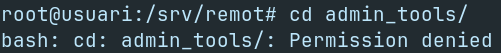

Ara per a podem mapejar la carpeta, però haurem de crear-la primer.

```bash
sudo mkdir /srv/remot
```

I per a poder accedir al recurs, haurem d'utilitzar la comanda `mount` per a muntar l'unitat.

```bash
sudo mount -t nfs 192.168.56.203:/srv/nfs /srv/remot
```

I podem veure que la carpeta del servidor està disponible.

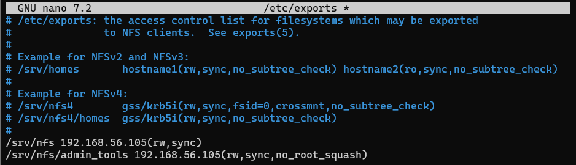

---

## Fase 3: L'Exportació d'Administració

El client necessita que el directori `/srv/nfs/admin_tools` sigui accessible per l'equip d'administradors.

Es per això que exportarem el directori `/srv/nfs/admin_tools` amb les opcions `rw,sync`.

```bash
/srv/nfs/admin_tools 192.168.56.105(rw,sync)
```


Un cop configurat, ja reiniciem el servei al servidor.

```bash
sudo systemctl restart nfs-kernel-server
```

Ens dirigim al client i ja podem mapejar la carpeta, però haurem de crear-la primer.

```bash
sudo mkdir /mnt/admin_tools
```

I per a poder accedir al recurs, haurem d'utilitzar la comanda `mount` per a muntar l'unitat a `/mnt/admin_tools`.

```bash
sudo mount -t nfs 192.168.56.203:/srv/nfs/admin_tools /mnt/admin_tools
```

<!-- Pero encara no tenim permisos, ja que per defecte en NFS, l'opció `root_squash` fa que l'usuari root del client sigui `nfsnobody`, el que evita que pugui modificar fitxers amb privilegis de superusuari al servidor.

Per això en intentar accedir per a crear un fitxer ens surt el següent error:


Per a sol·lucionar-ho haurem de configurar una exportació del directori `/srv/nfs/admin_tools` incluent l'opció de `no_root_squash`.

Per a fer-ho haurem de modificar l'arxiu `/etc/exports`.

```bash
/srv/nfs/admin_tools 192.168.56.105(rw,sync,no_root_squash)
```


Reiniciem el servei.

```bash
sudo systemctl restart nfs-kernel-server
```

I muntem la nova unitat al client.

```bash
sudo mkdir /mnt/admin_tools
sudo mount -t nfs 192.168.56.203:/srv/nfs/admin_tools /mnt/admin_tools
```

I podem veure que ja ens deixa accedir i crear arxius a dins de la carpeta.


 -->
